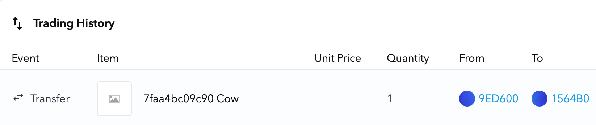

C++ `std::unique_ptr` that represents each object as an NFT on the Ethereum blockchain.

[](https://github.com/zhuowei/nft_ptr/actions/workflows/build.yml) Follow us: [worthdoingbadly.com](https://worthdoingbadly.com/) | [@zhuowei](https://twitter.com/zhuowei) | [@zhuowei@notnow.dev](https://notnow.dev/zhuowei)

# Example: moving between two `nft_ptr`s

```cpp
  auto ptr1 = make_nft<Cow>();
  nft_ptr<Animal> ptr2;

  ptr2 = std::move(ptr1);
```

This [transfers](https://goerli.etherscan.io/tx/0xcbe06fdd54bd9d221993c875022fe2960128874811a25075d692cc638a28f290) the Non-Fungible Token [0x7faa4bc09c90](https://testnets.opensea.io/assets/goerli/0x90eaf0ab2c6455a9b794f9dcf97839fa25b4ce2d/0x7faa4bc09c90), representing the `Cow`'s memory address, from `ptr1` ([OpenSea](https://testnets.opensea.io/accounts/0x9ed6006c6f3bb20737bdbe88cc6aa0de00597fef?tab=activity), [Etherscan](https://goerli.etherscan.io/address/0x9ed6006c6f3bb20737bdbe88cc6aa0de00597fef#tokentxnsErc721)) to `ptr2` ([OpenSea](https://testnets.opensea.io/accounts/0x1564b0a7c258fc88a96aa9fe1c513101883abb13?tab=activity), [Etherscan](https://goerli.etherscan.io/address/0x1564b0a7c258fc88a96aa9fe1c513101883abb13#tokentxnsErc721)).



```
[2021-04-09T01:59:48Z INFO  nft_ptr_lib] Transferring 0x7faa4bc09c90 (Cow) to 0x7ffee35a7890 (0x1564b0a7c258fc88a96aa9fe1c513101883abb13) from 0x7ffee35a78a8 (0x9ed6006c6f3bb20737bdbe88cc6aa0de00597fef) at PC=0x10c65a946 (main (example.cpp:33))
[2021-04-09T02:00:15Z INFO  nft_ptr_lib] Transaction: 0xcbe06fdd54bd9d221993c875022fe2960128874811a25075d692cc638a28f290
[2021-04-09T02:00:15Z INFO  nft_ptr_lib] https://testnets.opensea.io/assets/goerli/0x90eaf0ab2c6455a9b794f9dcf97839fa25b4ce2d/0x7faa4bc09c90
```

After the transfer, `ptr1` is set to null, and `ptr2` contains the new object, just like `std::unique_ptr`:

```cpp
  std::cout << "Moved: ptr1 = " << ptr1.get() << " ptr2 = " << ptr2.get()
            << std::endl;
  ptr2->MakeNoise();
```

```
  Moved: ptr1 = 0x0 ptr2 = 0x7faa4bc09c90
  Moo!
```

# Example: constructing an `nft_ptr` and minting an NFT

```cpp
  auto ptr1 = make_nft<Cow>();
```

This:
- initializes the `nft_ptr` runtime
- creates the first `nft_ptr<Cow>`
- transfers ownership of the newly created `Cow*` to the `nft_ptr`

First, it creates [an ERC-721 smart contract](https://goerli.etherscan.io/token/0x90eaf0ab2c6455a9b794f9dcf97839fa25b4ce2d) that represents each memory address as a Non-Fungible Token.

```
[2021-04-09T01:57:48Z INFO  nft_ptr_lib] Connected to network id 5
[2021-04-09T01:57:48Z INFO  nft_ptr_lib] Account: 0xd54b39c6bb7774aba2be4b49dc2667332b737909
[2021-04-09T01:57:48Z INFO  nft_ptr_lib] https://goerli.etherscan.io/address/0xd54b39c6bb7774aba2be4b49dc2667332b737909
[2021-04-09T01:57:48Z INFO  nft_ptr_lib] Deploying NFT contract!
[2021-04-09T01:58:18Z INFO  nft_ptr_lib] Token contract deployed at 0x90eaf0ab2c6455a9b794f9dcf97839fa25b4ce2d
[2021-04-09T01:58:18Z INFO  nft_ptr_lib] https://goerli.etherscan.io/token/0x90eaf0ab2c6455a9b794f9dcf97839fa25b4ce2d
```

Next, it creates [another smart contract](https://goerli.etherscan.io/token/0x9ed6006c6f3bb20737bdbe88cc6aa0de00597fef), that represents the `nft_ptr<Cow>` instance which can own NftPtr tokens:

```
[2021-04-09T01:58:18Z INFO  nft_ptr_lib] Deploying contract for nft_ptr 7ffee35a78a8 Cow main (example.cpp:25)
[2021-04-09T01:58:48Z INFO  nft_ptr_lib] Deployed contract for nft_ptr 7ffee35a78a8 Cow main (example.cpp:25) at 0x9ed6006c6f3bb20737bdbe88cc6aa0de00597fef
[2021-04-09T01:58:48Z INFO  nft_ptr_lib] https://goerli.etherscan.io/token/0x9ed6006c6f3bb20737bdbe88cc6aa0de00597fef
```

Finally, it calls `new Cow()`, and [mints an NFT](https://testnets.opensea.io/assets/goerli/0x90eaf0ab2c6455a9b794f9dcf97839fa25b4ce2d/0x7faa4bc09c90) for this memory address, owned by the new `nft_ptr<Cow>`.

```
[2021-04-09T01:58:48Z INFO  nft_ptr_lib] Transferring 0x7faa4bc09c90 (Cow) to 0x7ffee35a78a8 (0x9ed6006c6f3bb20737bdbe88cc6aa0de00597fef) from 0x0 (0xd54b39c6bb7774aba2be4b49dc2667332b737909) at PC=0x10c65a76f (main (example.cpp:25))
[2021-04-09T01:59:18Z INFO  nft_ptr_lib] Transaction: 0x0a148cee1abe8d4b5721996ea3a107c87b526ded155dc2e3895f1f42983bd2e8
[2021-04-09T01:59:18Z INFO  nft_ptr_lib] https://testnets.opensea.io/assets/goerli/0x90eaf0ab2c6455a9b794f9dcf97839fa25b4ce2d/0x7faa4bc09c90
```

# More examples

A full example program can be found at [example/example.cpp](example/example.cpp), along with a sample of its [output](example/logs/log_goerli_hosted.txt) when run.

A longer example, which shows using `nft_ptr` with function calls and STL containers, can be found at [example/long_example.cpp](example/long_example.cpp) along with its [output](example/logs/log_long_example_goerli.txt).

# Why?

- Biggest issue facing [$125 billion](https://www.idc.com/getdoc.jsp?containerId=prUS46773220) security industry: **Memory safety**.
  - "**~70%** of the vulnerabilities addressed through a security update each year continue to be memory safety issues." - [Microsoft Security Response Center](https://github.com/Microsoft/MSRC-Security-Research/blob/master/presentations/2019_02_BlueHatIL/2019_01%20-%20BlueHatIL%20-%20Trends%2C%20challenge%2C%20and%20shifts%20in%20software%20vulnerability%20mitigation.pdf)
- The world's largest codebases are written in **C++**
  - Browsers, operating systems, databases, financial systems
- C++ memory management is hard to understand, opaque, and not secure
- As we all know, adding blockchain to a problem **automatically** makes it simple, transparent, and cryptographically secure.

- Thus, we extend `std::unique_ptr`, the [most popular](https://www.chromium.org/developers/smart-pointer-guidelines) C++ smart pointer used for memory management, with blockchain support

- Non-Fungible Tokens and `std::unique_ptr` have the exact same semantics:
  - each token/object is unique, not fungible with other tokens/objects
  - each token/object is owned by one owner/`unique_ptr`
  - others may view the NFT/use the object, but only the owner can transfer/destroy the NFT/object.
  - absolutely no protection against just pirating the image represented by the NFT/copying the pointer out of the `unique_ptr`

- Written in Rust for the hipster cred.
- Made with 💖 by a Blockchain Expert who wrote like 100 lines of Solidity in 2017 (which didn't work)

For more information, please read our [white paper](white_paper.pdf).

# Performance

`nft_ptr` has negligible performance overhead compared to `std::unique_ptr`, as shown by this benchmark on [our example program](example/example.cpp):

| Implementation    | Runtime       |
|-------------------|:-------------:|
| `std::unique_ptr` | 0.005 seconds |
| `nft_ptr`         | 3 minutes     |

# What works

- Deploying ERC-721 smart contract on program start
- Create smart contract for each `nft_ptr` instance
- Call smart contract to create token when a pointer is transferred into an `nft_ptr`
- Transfer token when pointer moved between `nft_ptr`s

# Future steps

`nft_ptr` instances are themselves [ERC-20 tokens](https://goerli.etherscan.io/token/0x9ed6006c6f3bb20737bdbe88cc6aa0de00597fef) with 0 supply, for forward compatibility with our next library, `nft_shared_ptr`.

`nft_shared_ptr` will implement reference counting with security by selling shares to the owned object until the SEC complains.

# Obligatory system diagrams

How we call from C++ to Rust to Solidity:

```
+-----+              +------+              +--------+        +---------------+
|     |  extern "C"  |      |  rust-web3   |        |        |               |
| C++ +------------->| Rust +------------->| Wallet +------->| NFT Contracts |
|     |              |      |              |        |        |               |
+-----+              +------+              +--------+        +---------------+
```

How the [`NftPtrToken`](contracts/contracts/NftPtrToken.sol) contract and the [`NftPtrOwner`](contracts/contracts/NftPtrOwner.sol) contracts interact:

```
+-------------+          +-------------------+
| NftPtrToken |          | NftPtrOwner       |
|             | Owns     |                   |
| 0x41414141<--+---------+ nft_ptr<Animal>   |
|             |          +-------------------+
|             |
|             | Owns     +-------------------+
| 0x42424242<--+---------+ NftPtrOwner       |
|             |          |                   |
|             |          | nft_ptr<Animal>   |
| (1 instance |          +-------------------+
| per program)|          ...
|             |
+-------------+       (1 instance per nft_ptr)
```

# Sponsor development

For a limited time, you can buy any Git commit from this repository as a Non-Fungible Token on my Content-First Multimedia Proof-of-Authority revision-controlled realtime collaborative private enterprise [blockchain](https://docs.google.com/document/d/1d03A_-BAgwFZgmHh3TzEbGsvQ33albI9WT3fLa9gjtQ/edit) (a shared Google Doc).

You can also help by going full `r/roastme` on my code: this is only my second Rust project, and I would appreciate guidance on my journey to [carcinization](https://en.wikipedia.org/wiki/Carcinisation).

# What I learned

- how C++ smart pointers are implemented
- how to implement a Non-Fungible Token
- how the Ethereum ecosystem has evolved since I wrote my last smart contract in 2017
- how to integrate my previous Solidity, Truffle, and Ganache workflow with new tools such as OpenZeppelin and hosted wallets
- how to write a (trivial) program in Rust without fighting the borrow checker once
- how to use [rust-web3](https://github.com/tomusdrw/rust-web3), [serde_json](https://github.com/serde-rs/json), and the [openssl](https://docs.rs/openssl/0.10.33/openssl/) crates
- how to call Rust from C

# Building

All instructions tested on macOS 11.2.1.

You need:
- [Rustup](https://www.rust-lang.org)
- [npm](https://nodejs.org/)
- [Truffle](https://www.trufflesuite.com/truffle)
- [OpenSSL](https://github.com/sfackler/rust-openssl/blob/140ec193d5ad1ab91321069ccb2f86be947fafee/openssl/src/lib.rs#L30) (`brew install openssl@1.1`)
- and a C++17 compiler (Tested with Clang from Xcode 14.3).

```
cd contracts
npm install
truffle compile
./dumpbytecode
cd ../impl
rustup override set nightly
cargo build
cd ../example
./build.sh
```

# Testing (local blockchain)

Download and run [Ganache](https://www.trufflesuite.com/ganache) to setup a private local blockchain. Then, run

```
cd example
RUST_BACKTRACE=1 RUST_LOG=info ./example
```

# Testing (Görli testnet)

To run this against a public test blockchain, the easiest way is to use a hosted node.

Create a new keystore file on [MyEtherWallet](https://www.myetherwallet.com/create-wallet) and get some Görli test ethers from the [Görli faucet](https://faucet.goerli.mudit.blog).

**Do not use an existing wallet or password!** `nft_ptr` is very insecure; do not re-use a wallet or a password you care about, even for these worthless fake test ethers.

Run the example using your new keystore and a hosted node:

```
RUST_BACKTRACE=1 RUST_LOG=info NFT_PTR_HTTP="https://nodes.mewapi.io/rpc/goerli" \
NFT_PTR_NUM_CONFIRMATIONS=1 \
NFT_PTR_KEYSTORE="/path/to/your/MewWallet.keystore" \
NFT_PTR_PASSWORD="sample password" \
exec ./example
```

# Testing (Görli testnet + local lite node)

You can also run the example against a local lite node.

Download Geth and start a lite node connected to the Görli testnet:

```
./geth --goerli --syncmode light
```

Stop Geth and import your testnet wallet:

```
cp ~/Downloads/MewWallet.keystore ~/Library/Ethereum/goerli/keystore/
```

Restart Geth and unlock your testnet wallet: **This is insecure!**

```
./geth --goerli --syncmode light --unlock 0x<address> --http --allow-insecure-unlock
```

Enter your password, then hit Enter. It should say

```
Unlocked account                         address=0x<address>
```

Finally run with local HTTP transport:

```
cd example
./run.sh
```
